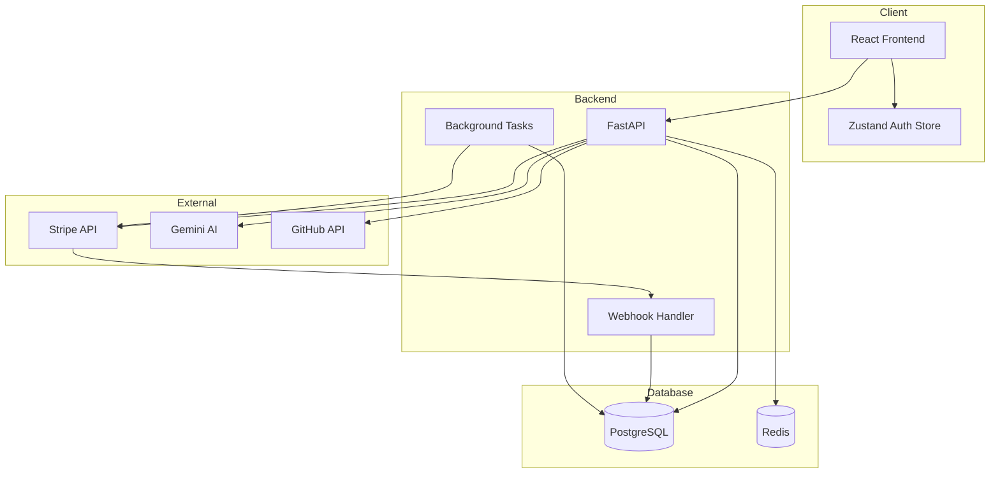

# PRD: LinkedIn Recommendation Writer - Monetization System

## 0) Snapshot

**Overview:** Implement a complete monetization system for the LinkedIn Recommendation Writer app, transforming it from a free tool into a sustainable SaaS business with tiered subscriptions, usage-based limits, and premium features.

**MVP Scope (Phase 1-2):**
- Stripe integration for payment processing
- Three subscription tiers: Free, Pro ($9/mo), Team ($29/mo)
- Database models for subscriptions and usage tracking
- Feature gating based on subscription tier
- Basic billing UI (pricing page, checkout, portal)

**Explicit Out of Scope (V2+):**
- Credit packs / pay-per-use model
- Referral system with rewards
- Team management / multi-seat licenses
- Annual billing discounts
- Mobile app billing (iOS/Android IAP)
- Crypto payments
- Invoicing for enterprises

**Key Assumptions:**
1. Stripe is the payment processor (widely supported, good DX)
2. Users will upgrade when hitting free tier limits
3. Monthly billing is the default (annual can be added later)
4. Existing role-based system can be extended for tiers

---

## 1) Executive Summary

### Problem Statement
The LinkedIn Recommendation Writer currently has no revenue model. Users can generate unlimited recommendations for free, which:
- Creates unsustainable AI API costs (Gemini usage)
- Provides no path to profitability
- Limits ability to invest in improvements
- Attracts low-commitment users who don't value the product

### Proposed Solution
Implement a freemium SaaS model with:
1. **Free tier** (3 recommendations/day) - Lead generation and product demonstration
2. **Pro tier** ($9/month, 50/day) - Power users and job seekers
3. **Team tier** ($29/month, unlimited + API) - Recruiters and HR professionals

### Success Metrics (KPIs)
| Metric | Target (90 days) | Measurement |
|--------|------------------|-------------|
| Monthly Recurring Revenue (MRR) | $500 | Stripe Dashboard |
| Paid Conversion Rate | 3-5% of active users | Users upgraded / Total active |
| Churn Rate | < 5% monthly | Cancelled / Total subscribers |
| Average Revenue Per User (ARPU) | $12 | MRR / Paid users |
| Free-to-Trial Conversion | 10% | Trial starts / Free users |

### Priority Level
**P0 - Critical** - Without monetization, the product cannot sustain itself. AI costs will increase with growth.

---

## 2) Personas, User Stories, and Flows

### Personas

#### 1. Alex the Job Seeker (Free → Pro)
- **Goals:** Get strong LinkedIn recommendations to land a new job
- **Context:** Currently employed, actively looking, needs 5-10 quality recommendations
- **Constraints:** Budget-conscious, needs quick results, limited technical skills
- **Conversion trigger:** Hits daily limit during active job search

#### 2. Maria the Recruiter (Team)
- **Goals:** Generate recommendations for candidates and help clients
- **Context:** Works at recruiting agency, handles 20+ candidates/month
- **Constraints:** Needs volume, must justify expense to employer, values time savings
- **Conversion trigger:** API access for workflow automation

#### 3. Sam the Casual User (Free)
- **Goals:** Occasional recommendation for colleague or direct report
- **Context:** Manager at tech company, needs recommendation 1-2x per quarter
- **Constraints:** Won't pay for occasional use, but may upgrade if needs increase
- **Conversion trigger:** May never convert, but provides word-of-mouth

#### 4. Dana the HR Director (Team → Enterprise)
- **Goals:** Standardize recommendation quality across organization
- **Context:** HR at 500+ person company, manages offboarding process
- **Constraints:** Needs security compliance, bulk operations, team management
- **Conversion trigger:** Team features and potential white-label

### User Stories

| ID | Story | Value | Tier |
|----|-------|-------|------|
| US-001 | As a user, I want to see my remaining generations so I know when I'll hit limits | Transparency | All |
| US-002 | As a free user, I want to see what premium features I'm missing so I can decide to upgrade | Conversion | Free |
| US-003 | As a user, I want to upgrade to Pro with one click so I can continue generating immediately | Conversion | Free |
| US-004 | As a Pro user, I want to manage my subscription so I can update payment or cancel | Retention | Pro |
| US-005 | As a user, I want a 7-day free trial of Pro so I can evaluate before committing | Acquisition | Free |
| US-006 | As a Team user, I want API access so I can integrate with my workflow | Value | Team |
| US-007 | As a subscriber, I want email receipts so I have records for expense reports | Trust | Paid |
| US-008 | As a user, I want to see pricing before signing up so I can evaluate cost | Transparency | All |

### Core User Journeys

#### Journey A: Free User Upgrades to Pro
```
1. User generates recommendations (free tier)
2. User hits daily limit (3/3 used)
3. System shows upgrade prompt with benefits
4. User clicks "Upgrade to Pro"
5. User enters payment info via Stripe Checkout
6. System provisions Pro access immediately
7. User continues generating with Pro limits (50/day)
8. User receives welcome email with Pro features guide
```

#### Journey B: New User Starts Trial
```
1. Visitor lands on pricing page
2. Visitor clicks "Start 7-Day Free Trial"
3. Visitor creates account (email/password)
4. Visitor enters payment method (charged after trial)
5. System provisions Pro access with trial flag
6. User uses product for 7 days
7. Day 5: Reminder email sent
8. Day 7: Card charged, subscription active
```

#### Journey C: Subscriber Manages Billing
```
1. User navigates to Settings > Billing
2. User sees current plan, usage, next billing date
3. User clicks "Manage Subscription"
4. Stripe Customer Portal opens
5. User updates card / cancels / changes plan
6. Portal redirects back to app
7. System syncs subscription status via webhook
```

### Edge Cases & Failure Modes

| Case | Handling |
|------|----------|
| Payment fails during checkout | Show error, allow retry, no access granted |
| Card expires mid-subscription | Stripe retries 4x over 2 weeks, then cancels |
| User cancels then resubscribes same day | Restore without duplicate charge |
| Webhook delivery fails | Stripe retries with exponential backoff |
| User disputes charge | Auto-downgrade, flag for review |
| Trial user doesn't add payment method | Downgrade to free after 7 days |
| Server error during upgrade | Idempotency keys prevent double charges |
| User at exactly 0 remaining | Block generation, show upgrade CTA |

### Accessibility Requirements
- Pricing page: Screen reader compatible, proper heading hierarchy
- Checkout: Stripe handles WCAG 2.1 AA compliance
- Usage dashboard: Color-blind friendly progress indicators
- Keyboard navigation: All billing actions accessible via keyboard
- Focus management: Return focus after modal closes

---

## 3) Functional Requirements (Testable)

### FR-001: Subscription Tier Enforcement
**Description:** System enforces generation limits based on user's subscription tier.

**Preconditions:** User is authenticated or anonymous

**Data Inputs:**
- User's current tier (free/pro/team/anonymous)
- User's generation count for current period
- Tier limits configuration

**Data Outputs:**
- Boolean: Can generate or not
- Remaining count
- Error message if blocked

**Acceptance Criteria:**
```gherkin
Given a free tier user with 3 generations today
When they attempt to generate a 4th recommendation
Then the request is blocked with HTTP 429
And the response includes upgrade_url and remaining_count: 0

Given a pro tier user with 49 generations today
When they attempt to generate a 50th recommendation
Then the generation succeeds
And remaining_count shows 1

Given a team tier user with 500 generations today
When they attempt to generate another recommendation
Then the generation succeeds (unlimited)
```

**Analytics Events:**
- `generation_blocked` - tier, count, timestamp
- `limit_warning_shown` - tier, remaining, threshold

---

### FR-002: Stripe Checkout Integration
**Description:** Users can upgrade via Stripe Checkout hosted page.

**Preconditions:** User is authenticated, not already subscribed to target tier

**Data Inputs:**
- User ID
- Target tier (pro/team)
- Success/cancel redirect URLs

**Data Outputs:**
- Checkout session URL
- Session ID for tracking

**Acceptance Criteria:**
```gherkin
Given an authenticated free user
When they click "Upgrade to Pro"
Then a Stripe Checkout session is created
And user is redirected to Stripe's hosted checkout page
And the checkout shows $9/month Pro plan

Given a user completes Stripe checkout successfully
When Stripe redirects to success URL
Then user's tier is updated to Pro
And user sees confirmation message
And user can immediately generate with Pro limits
```

**Analytics Events:**
- `checkout_started` - tier, user_id
- `checkout_completed` - tier, user_id, amount
- `checkout_abandoned` - tier, user_id

---

### FR-003: Stripe Webhook Processing
**Description:** System processes Stripe webhooks to sync subscription state.

**Preconditions:** Webhook endpoint configured in Stripe dashboard

**Data Inputs:**
- Stripe webhook event payload
- Stripe signature header

**Data Outputs:**
- HTTP 200 acknowledgment
- Database updates to subscription

**Acceptance Criteria:**
```gherkin
Given a valid checkout.session.completed webhook
When the webhook is received
Then user's subscription status is set to active
And subscription_id is stored
And tier is updated based on price_id

Given an invoice.payment_failed webhook
When the webhook is received
Then subscription status is set to past_due
And user receives email notification

Given a customer.subscription.deleted webhook
When the webhook is received
Then user's tier is downgraded to free
And subscription status is set to cancelled
```

**Analytics Events:**
- `webhook_received` - event_type
- `subscription_status_changed` - old_status, new_status, reason

---

### FR-004: Usage Tracking Dashboard
**Description:** Users can view their usage statistics and limits.

**Preconditions:** User is authenticated

**Data Inputs:**
- User ID
- Current billing period

**Data Outputs:**
- Generations used this period
- Generations remaining
- Period reset date
- Historical usage (last 30 days)

**Acceptance Criteria:**
```gherkin
Given a Pro user who has generated 25 recommendations today
When they view the usage dashboard
Then they see "25 of 50 used today"
And a progress bar at 50%
And "Resets in X hours"

Given a free user at their limit
When they view the usage dashboard
Then they see "3 of 3 used today"
And a prominent "Upgrade" button
And "Resets in X hours"
```

---

### FR-005: Pricing Page
**Description:** Public pricing page showing all tiers and features.

**Preconditions:** None (public page)

**Data Inputs:** None

**Data Outputs:**
- Tier comparison table
- Feature matrix
- CTA buttons per tier

**Acceptance Criteria:**
```gherkin
Given a visitor on the pricing page
When the page loads
Then they see Free, Pro ($9/mo), and Team ($29/mo) tiers
And a feature comparison matrix
And "Get Started" for Free, "Start Trial" for Pro, "Contact Sales" for Team

Given an authenticated Pro user on pricing page
When the page loads
Then the Pro tier shows "Current Plan"
And Team shows "Upgrade"
And Free shows nothing (can't downgrade via UI)
```

---

### FR-006: Customer Portal Access
**Description:** Subscribers can manage billing via Stripe Customer Portal.

**Preconditions:** User has active or past subscription

**Data Inputs:**
- User ID (to get Stripe customer ID)
- Return URL

**Data Outputs:**
- Portal session URL

**Acceptance Criteria:**
```gherkin
Given a Pro subscriber
When they click "Manage Subscription" in settings
Then they are redirected to Stripe Customer Portal
And can update payment method
And can cancel subscription
And can view invoice history

Given portal changes (e.g., cancellation)
When user is redirected back
Then app reflects updated subscription status
```

---

### FR-007: Trial Period Management
**Description:** New users can start a 7-day free trial of Pro.

**Preconditions:** User has never had a trial or paid subscription

**Data Inputs:**
- User ID
- Payment method (required to start trial)

**Data Outputs:**
- Trial start date
- Trial end date
- Subscription with trial status

**Acceptance Criteria:**
```gherkin
Given a new user who has never subscribed
When they start a Pro trial
Then they get Pro features immediately
And trial_ends_at is set to 7 days from now
And no charge is made

Given a user whose trial is ending in 2 days
When they log in
Then they see a banner "Trial ends in 2 days"
And can choose to continue or cancel

Given a trial that has ended
When the trial_ends_at passes
Then Stripe automatically charges the card
And subscription becomes active (non-trial)
```

---

### FR-008: Feature Gating
**Description:** Premium features are gated based on subscription tier.

**Preconditions:** Feature access check occurs before feature use

**Premium Features by Tier:**
| Feature | Free | Pro | Team |
|---------|------|-----|------|
| Daily generations | 3 | 50 | Unlimited |
| Multiple options per generation | 1 | 3 | 5 |
| Tone customization | Basic | All | All |
| Keyword refinement | No | Yes | Yes |
| Version history | Last 5 | All | All |
| API access | No | No | Yes |
| Priority support | No | No | Yes |

**Acceptance Criteria:**
```gherkin
Given a free user generating a recommendation
When options are returned
Then only 1 option is provided

Given a Pro user generating a recommendation
When options are returned
Then 3 options are provided
And keyword refinement is available

Given a Team user making an API request
When they use a valid API key
Then the request succeeds with team limits
```

---

## 4) UX/UI Design Specifications

### Routes (React Router 7)

| Route | Component | Auth | Description |
|-------|-----------|------|-------------|
| `/pricing` | `PricingPage` | Public | Tier comparison and CTAs |
| `/checkout/success` | `CheckoutSuccess` | Auth | Post-checkout confirmation |
| `/checkout/cancel` | `CheckoutCancel` | Auth | Checkout cancelled |
| `/settings/billing` | `BillingSettings` | Auth | Usage and subscription management |
| `/api-keys` | `ApiKeysPage` | Auth+Team | API key management (Team only) |

### Layout & Components (ShadCN)

#### Pricing Page (`/pricing`)
```
<PricingPage>
  <PricingHeader>
    <h1>Simple, Transparent Pricing</h1>
    <p>Start free, upgrade when you need more</p>
  </PricingHeader>

  <PricingGrid> <!-- 3 columns on desktop, stack on mobile -->
    <PricingCard tier="free">
      <CardHeader>
        <Badge>Free</Badge>
        <Price>$0</Price>
        <p>For occasional use</p>
      </CardHeader>
      <FeatureList features={freeFeatures} />
      <Button variant="outline">Get Started</Button>
    </PricingCard>

    <PricingCard tier="pro" highlighted>
      <Badge variant="primary">Most Popular</Badge>
      <CardHeader>
        <Price>$9<span>/month</span></Price>
        <p>For job seekers & professionals</p>
      </CardHeader>
      <FeatureList features={proFeatures} />
      <Button>Start 7-Day Free Trial</Button>
    </PricingCard>

    <PricingCard tier="team">
      <CardHeader>
        <Price>$29<span>/month</span></Price>
        <p>For recruiters & teams</p>
      </CardHeader>
      <FeatureList features={teamFeatures} />
      <Button variant="outline">Start Trial</Button>
    </PricingCard>
  </PricingGrid>

  <FeatureComparison> <!-- Detailed table -->
    <Table>...</Table>
  </FeatureComparison>

  <FAQ>
    <Accordion items={pricingFAQ} />
  </FAQ>
</PricingPage>
```

#### Billing Settings (`/settings/billing`)
```
<BillingSettings>
  <PageHeader>
    <h1>Billing & Usage</h1>
  </PageHeader>

  <div className="grid gap-6 md:grid-cols-2">
    <Card>
      <CardHeader>Current Plan</CardHeader>
      <CardContent>
        <Badge>{currentTier}</Badge>
        <p>Next billing: {nextBillingDate}</p>
        <Button onClick={openPortal}>Manage Subscription</Button>
      </CardContent>
    </Card>

    <Card>
      <CardHeader>Usage This Period</CardHeader>
      <CardContent>
        <Progress value={usagePercent} />
        <p>{used} of {limit} generations</p>
        <p className="text-muted">Resets {resetDate}</p>
      </CardContent>
    </Card>
  </div>

  <Card>
    <CardHeader>Usage History</CardHeader>
    <CardContent>
      <UsageChart data={last30Days} />
    </CardContent>
  </Card>
</BillingSettings>
```

#### Upgrade Prompt (Modal/Sheet)
```
<UpgradePrompt>
  <SheetHeader>
    <SheetTitle>You've reached your daily limit</SheetTitle>
    <SheetDescription>
      Upgrade to Pro for 50 generations per day
    </SheetDescription>
  </SheetHeader>

  <div className="space-y-4">
    <div className="flex items-center gap-2">
      <Check className="text-green-500" />
      <span>50 recommendations per day</span>
    </div>
    <div className="flex items-center gap-2">
      <Check className="text-green-500" />
      <span>Multiple recommendation options</span>
    </div>
    <div className="flex items-center gap-2">
      <Check className="text-green-500" />
      <span>Keyword refinement</span>
    </div>
  </div>

  <SheetFooter>
    <Button onClick={startCheckout}>
      Upgrade to Pro - $9/month
    </Button>
    <Button variant="ghost" onClick={close}>
      Maybe later
    </Button>
  </SheetFooter>
</UpgradePrompt>
```

### Responsive Behavior

| Breakpoint | Pricing Grid | Billing Cards | Navigation |
|------------|--------------|---------------|------------|
| Mobile (<640px) | Stack vertical | Stack vertical | Sheet menu |
| Tablet (640-1024px) | 2 columns | 2 columns | Condensed nav |
| Desktop (>1024px) | 3 columns | 2 columns | Full nav |

### Interaction Details

- **Checkout button loading:** Show spinner, disable button, "Processing..."
- **Upgrade success:** Confetti animation, success toast, auto-close modal
- **Limit warning:** Yellow banner at 80% usage, red at 100%
- **Portal redirect:** Show "Redirecting to billing portal..." overlay

### States

| Component | Loading | Empty | Error |
|-----------|---------|-------|-------|
| Pricing Page | Skeleton cards | N/A | "Failed to load pricing" |
| Billing Settings | Skeleton + spinner | "No subscription" card | "Failed to load billing" |
| Usage Chart | Skeleton bars | "No usage data yet" | "Failed to load usage" |
| Checkout | Full-page spinner | N/A | Toast + retry option |

---

## 5) Technical Architecture

### System Diagram (Mermaid)



### API Contracts

#### Authentication
- **Method:** JWT Bearer tokens (existing)
- **Header:** `Authorization: Bearer <token>`
- **Roles:** `anonymous`, `free`, `pro`, `team`, `admin`

#### Endpoints

| Method | Path | Purpose | Auth | Notes |
|--------|------|---------|------|-------|
| GET | `/api/v1/billing/plans` | List available plans | Public | Cached |
| POST | `/api/v1/billing/checkout` | Create checkout session | Auth | Returns Stripe URL |
| POST | `/api/v1/billing/portal` | Create portal session | Auth | Returns Stripe URL |
| GET | `/api/v1/billing/subscription` | Get current subscription | Auth | |
| GET | `/api/v1/billing/usage` | Get usage stats | Auth | |
| POST | `/api/v1/billing/webhooks` | Stripe webhooks | Stripe Sig | |
| POST | `/api/v1/api-keys` | Create API key | Auth+Team | |
| GET | `/api/v1/api-keys` | List API keys | Auth+Team | |
| DELETE | `/api/v1/api-keys/{id}` | Revoke API key | Auth+Team | |

#### Request/Response Schemas

```python
# Plans Response
{
    "plans": [
        {
            "id": "free",
            "name": "Free",
            "price_cents": 0,
            "interval": null,
            "features": ["3 generations/day", "1 option per generation"],
            "limits": {"daily_generations": 3, "options_per_generation": 1}
        },
        {
            "id": "pro",
            "name": "Pro",
            "price_cents": 900,
            "interval": "month",
            "stripe_price_id": "price_xxx",
            "features": ["50 generations/day", "3 options", "Keyword refinement"],
            "limits": {"daily_generations": 50, "options_per_generation": 3}
        },
        {
            "id": "team",
            "name": "Team",
            "price_cents": 2900,
            "interval": "month",
            "stripe_price_id": "price_yyy",
            "features": ["Unlimited generations", "API access", "Priority support"],
            "limits": {"daily_generations": -1, "options_per_generation": 5}
        }
    ]
}

# Checkout Request
{
    "price_id": "price_xxx",
    "success_url": "https://app.example.com/checkout/success",
    "cancel_url": "https://app.example.com/checkout/cancel"
}

# Checkout Response
{
    "checkout_url": "https://checkout.stripe.com/...",
    "session_id": "cs_xxx"
}

# Subscription Response
{
    "id": 123,
    "tier": "pro",
    "status": "active",
    "stripe_subscription_id": "sub_xxx",
    "stripe_customer_id": "cus_xxx",
    "current_period_start": "2025-01-01T00:00:00Z",
    "current_period_end": "2025-02-01T00:00:00Z",
    "cancel_at_period_end": false,
    "trial_end": null
}

# Usage Response
{
    "tier": "pro",
    "period_start": "2025-01-01T00:00:00Z",
    "period_end": "2025-02-01T00:00:00Z",
    "generations_used": 25,
    "generations_limit": 50,
    "generations_remaining": 25,
    "resets_at": "2025-01-02T00:00:00Z",
    "history": [
        {"date": "2024-12-30", "count": 10},
        {"date": "2024-12-31", "count": 15}
    ]
}

# Error Response (standard)
{
    "detail": "Daily generation limit exceeded",
    "error_code": "LIMIT_EXCEEDED",
    "upgrade_url": "/pricing"
}
```

### API Response Standards

**Success:** Raw JSON responses (matching existing pattern)

**Error Envelope:**
```json
{
    "detail": "Human-readable message",
    "error_code": "MACHINE_READABLE_CODE",
    "extra": {}
}
```

**HTTP Status Mapping:**
- 400: Validation errors
- 401: Not authenticated
- 402: Payment required (upgrade needed)
- 403: Not authorized (wrong tier)
- 404: Not found
- 429: Rate limited / generation limit
- 500: Server error

### OpenAPI Starter Snippet

```yaml
# /api/openapi.yaml
openapi: 3.0.3
info:
  title: LinkedIn Recommendation Writer - Billing API
  version: 1.0.0

servers:
  - url: /api/v1

components:
  securitySchemes:
    bearerAuth:
      type: http
      scheme: bearer
      bearerFormat: JWT

  schemas:
    Plan:
      type: object
      properties:
        id:
          type: string
          enum: [free, pro, team]
        name:
          type: string
        price_cents:
          type: integer
        interval:
          type: string
          enum: [month, year, null]
        stripe_price_id:
          type: string
          nullable: true
        features:
          type: array
          items:
            type: string
        limits:
          $ref: '#/components/schemas/TierLimits'

    TierLimits:
      type: object
      properties:
        daily_generations:
          type: integer
          description: -1 for unlimited
        options_per_generation:
          type: integer

    Subscription:
      type: object
      properties:
        id:
          type: integer
        tier:
          type: string
        status:
          type: string
          enum: [active, past_due, cancelled, trialing]
        current_period_end:
          type: string
          format: date-time
        cancel_at_period_end:
          type: boolean

    Usage:
      type: object
      properties:
        generations_used:
          type: integer
        generations_limit:
          type: integer
        generations_remaining:
          type: integer
        resets_at:
          type: string
          format: date-time

    Error:
      type: object
      properties:
        detail:
          type: string
        error_code:
          type: string
        upgrade_url:
          type: string

paths:
  /billing/plans:
    get:
      summary: List available plans
      responses:
        '200':
          description: Plans list
          content:
            application/json:
              schema:
                type: object
                properties:
                  plans:
                    type: array
                    items:
                      $ref: '#/components/schemas/Plan'

  /billing/checkout:
    post:
      summary: Create Stripe checkout session
      security:
        - bearerAuth: []
      requestBody:
        content:
          application/json:
            schema:
              type: object
              required: [price_id]
              properties:
                price_id:
                  type: string
                success_url:
                  type: string
                cancel_url:
                  type: string
      responses:
        '200':
          description: Checkout session created
          content:
            application/json:
              schema:
                type: object
                properties:
                  checkout_url:
                    type: string
                  session_id:
                    type: string
        '400':
          description: Invalid request
        '401':
          description: Not authenticated

  /billing/subscription:
    get:
      summary: Get current subscription
      security:
        - bearerAuth: []
      responses:
        '200':
          description: Subscription details
          content:
            application/json:
              schema:
                $ref: '#/components/schemas/Subscription'

  /billing/usage:
    get:
      summary: Get usage statistics
      security:
        - bearerAuth: []
      responses:
        '200':
          description: Usage stats
          content:
            application/json:
              schema:
                $ref: '#/components/schemas/Usage'
```

### Database & Data Model

#### New Tables

```sql
-- Subscriptions table
CREATE TABLE subscriptions (
    id SERIAL PRIMARY KEY,
    user_id INTEGER NOT NULL REFERENCES users(id) ON DELETE CASCADE,

    -- Stripe IDs
    stripe_customer_id VARCHAR(255) NOT NULL,
    stripe_subscription_id VARCHAR(255),
    stripe_price_id VARCHAR(255),

    -- Status
    tier VARCHAR(50) NOT NULL DEFAULT 'free', -- free, pro, team
    status VARCHAR(50) NOT NULL DEFAULT 'active', -- active, past_due, cancelled, trialing

    -- Billing period
    current_period_start TIMESTAMP WITH TIME ZONE,
    current_period_end TIMESTAMP WITH TIME ZONE,

    -- Trial
    trial_start TIMESTAMP WITH TIME ZONE,
    trial_end TIMESTAMP WITH TIME ZONE,

    -- Cancellation
    cancel_at_period_end BOOLEAN DEFAULT FALSE,
    cancelled_at TIMESTAMP WITH TIME ZONE,

    -- Timestamps
    created_at TIMESTAMP WITH TIME ZONE DEFAULT NOW(),
    updated_at TIMESTAMP WITH TIME ZONE DEFAULT NOW(),

    -- Constraints
    UNIQUE(user_id),
    UNIQUE(stripe_customer_id),
    UNIQUE(stripe_subscription_id)
);

CREATE INDEX idx_subscriptions_user_id ON subscriptions(user_id);
CREATE INDEX idx_subscriptions_stripe_customer_id ON subscriptions(stripe_customer_id);
CREATE INDEX idx_subscriptions_status ON subscriptions(status);

-- Usage tracking table (for historical data)
CREATE TABLE usage_records (
    id SERIAL PRIMARY KEY,
    user_id INTEGER NOT NULL REFERENCES users(id) ON DELETE CASCADE,

    -- Usage data
    date DATE NOT NULL,
    generation_count INTEGER DEFAULT 0,

    -- Metadata
    tier VARCHAR(50) NOT NULL,

    -- Timestamps
    created_at TIMESTAMP WITH TIME ZONE DEFAULT NOW(),
    updated_at TIMESTAMP WITH TIME ZONE DEFAULT NOW(),

    -- Constraints
    UNIQUE(user_id, date)
);

CREATE INDEX idx_usage_records_user_date ON usage_records(user_id, date);

-- API Keys table (for Team tier)
CREATE TABLE api_keys (
    id SERIAL PRIMARY KEY,
    user_id INTEGER NOT NULL REFERENCES users(id) ON DELETE CASCADE,

    -- Key data
    name VARCHAR(255) NOT NULL,
    key_hash VARCHAR(255) NOT NULL, -- Hashed API key
    key_prefix VARCHAR(10) NOT NULL, -- First 8 chars for identification

    -- Permissions
    scopes TEXT[] DEFAULT '{}', -- e.g., ['recommendations:read', 'recommendations:write']

    -- Usage tracking
    last_used_at TIMESTAMP WITH TIME ZONE,
    usage_count INTEGER DEFAULT 0,

    -- Status
    is_active BOOLEAN DEFAULT TRUE,
    expires_at TIMESTAMP WITH TIME ZONE,

    -- Timestamps
    created_at TIMESTAMP WITH TIME ZONE DEFAULT NOW(),

    -- Constraints
    UNIQUE(key_hash)
);

CREATE INDEX idx_api_keys_user_id ON api_keys(user_id);
CREATE INDEX idx_api_keys_key_prefix ON api_keys(key_prefix);

-- Webhook events log (for debugging and idempotency)
CREATE TABLE stripe_webhook_events (
    id SERIAL PRIMARY KEY,
    stripe_event_id VARCHAR(255) NOT NULL UNIQUE,
    event_type VARCHAR(255) NOT NULL,
    payload JSONB NOT NULL,
    processed_at TIMESTAMP WITH TIME ZONE,
    error TEXT,
    created_at TIMESTAMP WITH TIME ZONE DEFAULT NOW()
);

CREATE INDEX idx_webhook_events_stripe_id ON stripe_webhook_events(stripe_event_id);
CREATE INDEX idx_webhook_events_type ON stripe_webhook_events(event_type);
```

#### User Model Updates

```sql
-- Add subscription-related fields to users table
ALTER TABLE users
ADD COLUMN IF NOT EXISTS stripe_customer_id VARCHAR(255) UNIQUE,
ADD COLUMN IF NOT EXISTS subscription_tier VARCHAR(50) DEFAULT 'free',
ADD COLUMN IF NOT EXISTS subscription_status VARCHAR(50) DEFAULT 'active';

CREATE INDEX idx_users_stripe_customer_id ON users(stripe_customer_id);
CREATE INDEX idx_users_subscription_tier ON users(subscription_tier);
```

### Migration Plan

1. **Migration 001:** Add subscription tables
2. **Migration 002:** Add user subscription fields
3. **Migration 003:** Add API keys table
4. **Migration 004:** Add webhook events table
5. **Migration 005:** Backfill existing users with `tier='free'`

### State Management (Zustand)

#### Subscription Store

```typescript
// frontend/app/hooks/useSubscriptionStore.ts
interface SubscriptionState {
  // State
  subscription: Subscription | null;
  usage: Usage | null;
  plans: Plan[];
  isLoading: boolean;
  error: string | null;

  // Actions
  fetchSubscription: () => Promise<void>;
  fetchUsage: () => Promise<void>;
  fetchPlans: () => Promise<void>;
  createCheckout: (priceId: string) => Promise<string>;
  openPortal: () => Promise<string>;
  clearError: () => void;
}

// What goes in Zustand vs TanStack Query:
// - Zustand: Current subscription/usage (user-specific, changes rarely)
// - TanStack Query: Plans list (cacheable, shared across users)
```

#### Auth Store Updates

```typescript
// Extend existing useAuthStore
interface AuthState {
  // Existing...

  // New subscription fields
  subscriptionTier: 'free' | 'pro' | 'team';
  generationsRemaining: number;
  generationsLimit: number;

  // New actions
  refreshSubscription: () => Promise<void>;
}
```

### Client Data Lifecycle

| Data | Store | Persistence | Reason |
|------|-------|-------------|--------|
| Current subscription | Zustand | Memory only | Sensitive, fetch on login |
| Usage stats | TanStack Query | 5min cache | Changes frequently |
| Plans list | TanStack Query | 1hr cache | Rarely changes |
| Checkout session | None | URL param | One-time use |
| API keys | TanStack Query | No cache | Security sensitive |

**Cache Invalidation:**
- After checkout success: Invalidate subscription + usage
- After portal return: Invalidate subscription
- On generation: Invalidate usage
- On login: Fetch fresh subscription

**Never Persist:**
- Stripe session IDs
- API key values (only show once)
- Payment method details

### Server State (TanStack Query)

```typescript
// Query keys
const queryKeys = {
  plans: ['billing', 'plans'],
  subscription: ['billing', 'subscription'],
  usage: ['billing', 'usage'],
  apiKeys: ['billing', 'api-keys'],
};

// Caching rules
const queryConfig = {
  plans: { staleTime: 60 * 60 * 1000 }, // 1 hour
  subscription: { staleTime: 5 * 60 * 1000 }, // 5 minutes
  usage: { staleTime: 60 * 1000 }, // 1 minute
  apiKeys: { staleTime: 0 }, // Always fresh
};

// Invalidation after mutations
const mutations = {
  createCheckout: {
    onSuccess: () => {
      // Don't invalidate yet - wait for webhook
    }
  },
  createApiKey: {
    onSuccess: () => {
      queryClient.invalidateQueries({ queryKey: queryKeys.apiKeys });
    }
  }
};
```

### Error Handling & Logging

**Error Taxonomy:**
| Type | HTTP Code | User Message | Log Level |
|------|-----------|--------------|-----------|
| Validation | 400 | Show field errors | INFO |
| Auth | 401 | "Please log in" | WARN |
| Tier | 402/403 | Show upgrade prompt | INFO |
| Limit | 429 | "Limit reached" | INFO |
| Stripe | 500 | "Payment error, try again" | ERROR |
| Server | 500 | "Something went wrong" | ERROR |

**Logging Fields:**
```python
{
    "request_id": "uuid",
    "user_id": 123,
    "tier": "pro",
    "action": "checkout_create",
    "stripe_session_id": "cs_xxx",
    "timestamp": "2025-01-01T00:00:00Z"
}
```

### Performance Targets

| Metric | Target | Measurement |
|--------|--------|-------------|
| Checkout creation | < 500ms p95 | API latency |
| Usage check | < 50ms p95 | Inline with generation |
| Webhook processing | < 2s | End-to-end |
| Pricing page LCP | < 2s | Core Web Vitals |

---

## 6) Scalability & Performance Plan

### Expected Load
- **Users:** 1,000 active users (Month 1) → 10,000 (Month 6)
- **Subscriptions:** ~50 Pro, ~10 Team (Month 1)
- **Generations:** ~5,000/day at scale
- **Webhooks:** ~100/day (subscription events)

### Scaling Approach
- **Database:** PostgreSQL connection pooling (already configured)
- **Redis:** Cache subscription status to avoid DB hits
- **Webhooks:** Process async via background worker
- **Stripe:** Use idempotency keys for all mutations

### Database Optimization
- Index on `subscriptions.user_id` (primary lookup)
- Index on `subscriptions.stripe_customer_id` (webhook lookup)
- Composite index on `usage_records(user_id, date)` (daily lookup)
- Connection pooling: 10-20 connections

### Caching Strategy
```python
# Redis cache keys
subscription:{user_id} -> Subscription JSON (TTL: 5 min)
usage:{user_id}:{date} -> Usage count (TTL: 1 day)
plans -> Plans JSON (TTL: 1 hour)
```

---

## 7) Security & Compliance

### Top 5 Threats & Mitigations

| Threat | Mitigation |
|--------|------------|
| Webhook spoofing | Verify Stripe signature on all webhooks |
| Subscription tampering | Server-side tier enforcement, never trust client |
| API key theft | Hash keys, show only once, allow revocation |
| Payment fraud | Stripe Radar, monitor for chargebacks |
| Privilege escalation | Check tier on every protected endpoint |

### AuthN/AuthZ Requirements

**Authentication:** Existing JWT system (no changes needed)

**Authorization Matrix:**

| Action | Anonymous | Free | Pro | Team | Admin |
|--------|-----------|------|-----|------|-------|
| Generate (basic) | 3/day | 3/day | 50/day | Unlimited | Unlimited |
| Multiple options | No | No | Yes | Yes | Yes |
| Keyword refinement | No | No | Yes | Yes | Yes |
| API access | No | No | No | Yes | Yes |
| Create API keys | No | No | No | Yes | Yes |
| View billing | No | Yes | Yes | Yes | Yes |
| Admin panel | No | No | No | No | Yes |

### Input Validation
- Stripe price IDs: Validate against known list
- Webhook payloads: Validate signature before parsing
- API keys: 32+ character random strings, hashed with bcrypt

### Encryption
- **Transit:** HTTPS only (existing)
- **At rest:** API keys hashed with bcrypt
- **Stripe:** All sensitive data stored by Stripe, not us

### Rate Limiting
- Checkout creation: 5/minute per user
- Portal access: 10/minute per user
- API endpoints: 100/minute per API key
- Webhooks: No limit (Stripe controls)

### Secrets Management
- `STRIPE_SECRET_KEY` - Environment variable
- `STRIPE_WEBHOOK_SECRET` - Environment variable
- Never log full API keys or Stripe IDs in production

### Audit Logging
```python
# Log all billing events
audit_log.info("subscription_created", {
    "user_id": user.id,
    "tier": "pro",
    "stripe_subscription_id": "sub_xxx",
    "amount_cents": 900
})

audit_log.info("subscription_cancelled", {
    "user_id": user.id,
    "tier": "pro",
    "reason": "user_requested",
    "effective_date": "2025-02-01"
})
```

---

## 8) Testing Strategy

### Unit Test Coverage Target: ≥80%

#### Backend Unit Tests
```python
# tests/unit/test_billing_service.py
def test_get_tier_limits_free():
    limits = get_tier_limits("free")
    assert limits.daily_generations == 3
    assert limits.options_per_generation == 1

def test_get_tier_limits_pro():
    limits = get_tier_limits("pro")
    assert limits.daily_generations == 50
    assert limits.options_per_generation == 3

def test_check_generation_limit_under():
    user = User(tier="pro", recommendation_count=25)
    result = check_can_generate(user)
    assert result.allowed == True
    assert result.remaining == 25

def test_check_generation_limit_at_limit():
    user = User(tier="free", recommendation_count=3)
    result = check_can_generate(user)
    assert result.allowed == False
    assert result.remaining == 0
```

#### Frontend Unit Tests
```typescript
// tests/billing.test.ts
describe('useSubscriptionStore', () => {
  it('calculates remaining generations correctly', () => {
    const store = useSubscriptionStore.getState();
    store.setUsage({ used: 25, limit: 50 });
    expect(store.generationsRemaining).toBe(25);
  });

  it('shows upgrade prompt at limit', () => {
    const store = useSubscriptionStore.getState();
    store.setUsage({ used: 3, limit: 3 });
    expect(store.shouldShowUpgrade).toBe(true);
  });
});
```

### Integration Tests

```python
# tests/integration/test_billing_api.py
async def test_create_checkout_session():
    response = await client.post(
        "/api/v1/billing/checkout",
        json={"price_id": "price_pro_monthly"},
        headers={"Authorization": f"Bearer {user_token}"}
    )
    assert response.status_code == 200
    assert "checkout_url" in response.json()
    assert response.json()["checkout_url"].startswith("https://checkout.stripe.com")

async def test_webhook_checkout_completed():
    payload = create_stripe_webhook_payload("checkout.session.completed")
    response = await client.post(
        "/api/v1/billing/webhooks",
        content=payload,
        headers={"Stripe-Signature": generate_signature(payload)}
    )
    assert response.status_code == 200

    # Verify user was upgraded
    user = await get_user(user_id)
    assert user.subscription_tier == "pro"
```

### E2E Critical Paths (Playwright)

1. **Free → Pro upgrade flow**
   ```typescript
   test('user can upgrade from free to pro', async ({ page }) => {
     await page.goto('/generate');
     // Generate 3 recommendations to hit limit
     for (let i = 0; i < 3; i++) {
       await generateRecommendation(page);
     }
     // Should see upgrade prompt
     await expect(page.getByText('daily limit')).toBeVisible();
     await page.click('text=Upgrade to Pro');
     // Should redirect to Stripe (mock in test)
     await expect(page).toHaveURL(/checkout.stripe.com/);
   });
   ```

2. **View billing settings**
3. **Start and complete trial**
4. **Cancel subscription**
5. **API key creation (Team)**

### Accessibility Testing
- [ ] Pricing page passes axe-core audit
- [ ] All buttons have accessible names
- [ ] Focus order is logical on checkout flow
- [ ] Screen reader announces upgrade prompts

### Security Testing (OWASP)
- [ ] Webhook signature validation
- [ ] No sensitive data in logs
- [ ] API keys properly hashed
- [ ] Tier checks cannot be bypassed

---

## 9) Implementation Plan

### Phases

#### Phase 1: Foundation (MVP)
**Effort:** L (2-3 weeks dev time)

**Deliverables:**
- Database migrations for subscriptions
- Stripe integration (checkout, webhooks)
- Tier-based generation limits
- Basic pricing page

**Milestone:** Users can upgrade to Pro and generate with Pro limits

#### Phase 2: Billing UI
**Effort:** M (1-2 weeks)

**Deliverables:**
- Billing settings page
- Usage dashboard
- Customer portal integration
- Upgrade prompts

**Milestone:** Users can manage subscriptions self-service

#### Phase 3: Premium Features
**Effort:** M (1-2 weeks)

**Deliverables:**
- Multiple recommendation options (gated)
- Keyword refinement (gated)
- Team tier API keys

**Milestone:** Clear value differentiation between tiers

#### Phase 4: Growth Features (V2)
**Effort:** L (2-3 weeks)

**Deliverables:**
- 7-day free trial
- Usage history charts
- Email notifications (trial ending, payment failed)

**Milestone:** Improved conversion and retention

### Dependencies & Blockers
- Stripe account setup and API keys
- Domain verification for Stripe
- Webhook endpoint publicly accessible
- SSL certificate (already have via Railway)

### Deployment Strategy

**Feature Flags:**
```python
FEATURE_FLAGS = {
    "billing_enabled": True,  # Master switch
    "trials_enabled": False,  # Enable after initial launch
    "team_tier_enabled": False,  # Enable when API ready
}
```

**Rollout Plan:**
1. Deploy backend changes (webhooks, models)
2. Deploy pricing page (hidden route)
3. Enable billing for beta users (feature flag)
4. Full rollout after 1 week of beta
5. Enable trials after conversion baseline established

**Rollback Plan:**
1. Disable billing feature flag
2. Users on free limits until fix
3. No data loss (subscriptions remain in Stripe)
4. Refund affected users if needed

### Verification Contract

```bash
# Install dependencies
cd backend && pip install stripe && cd ..
cd frontend && npm install @stripe/stripe-js && cd ..

# Typecheck
cd frontend && npm run typecheck

# Lint
cd backend && flake8 app/api/v1/billing.py app/services/billing/
cd frontend && npm run lint

# Unit tests
cd backend && python -m pytest tests/unit/test_billing*.py -v
cd frontend && npm test -- --grep billing

# Integration tests
cd backend && python -m pytest tests/integration/test_billing*.py -v

# Build
cd frontend && npm run build
```

**Pass Criteria:**
- All commands exit 0
- No TypeScript errors
- No linting errors
- ≥80% test coverage on billing code

### Manual Smoke Test (≤5 minutes)

1. Visit `/pricing` - verify 3 tiers displayed
2. Click "Start Trial" on Pro - verify Stripe checkout loads
3. Complete test checkout (use Stripe test card `4242...`)
4. Verify redirect to success page
5. Visit `/settings/billing` - verify Pro subscription shown
6. Generate recommendation - verify Pro limits apply (50/day)
7. Click "Manage Subscription" - verify portal opens

---

## 10) Monitoring & Observability

### Metrics to Track

| Metric | Type | Alert Threshold |
|--------|------|-----------------|
| `billing.checkout.created` | Counter | N/A |
| `billing.checkout.completed` | Counter | N/A |
| `billing.checkout.conversion_rate` | Gauge | < 50% (of started) |
| `billing.subscription.active` | Gauge | N/A |
| `billing.subscription.churned` | Counter | > 5/day |
| `billing.webhook.processed` | Counter | N/A |
| `billing.webhook.failed` | Counter | > 0 |
| `billing.revenue.mrr` | Gauge | N/A |
| `generation.limit_hit` | Counter | N/A |
| `generation.upgrade_shown` | Counter | N/A |

### Dashboards

1. **Revenue Dashboard**
   - MRR trend
   - Subscription counts by tier
   - Conversion funnel

2. **Usage Dashboard**
   - Generations per day
   - Limit hits per day
   - Upgrade prompt → checkout conversion

3. **Health Dashboard**
   - Webhook success rate
   - API latency p95
   - Error rates

### Alerts

| Alert | Condition | Severity |
|-------|-----------|----------|
| Webhook failures | > 5 failures in 1 hour | Critical |
| Checkout errors | > 10% error rate | High |
| Revenue drop | MRR down > 20% week-over-week | Medium |

### Analytics Events

```typescript
// Event naming convention: noun_verb
const events = {
  // Conversion funnel
  'pricing_page_viewed': { tier_highlighted: string },
  'checkout_started': { tier: string, source: string },
  'checkout_completed': { tier: string, amount_cents: number },
  'checkout_abandoned': { tier: string, step: string },

  // Usage
  'generation_limit_reached': { tier: string, count: number },
  'upgrade_prompt_shown': { trigger: string },
  'upgrade_prompt_clicked': {},
  'upgrade_prompt_dismissed': {},

  // Retention
  'subscription_cancelled': { tier: string, reason: string },
  'subscription_reactivated': { tier: string },
};
```

---

## 11) Documentation Requirements

### Code Documentation
- Inline comments for Stripe webhook handling
- Docstrings for all billing service methods
- Type hints for all billing models

### API Documentation
- OpenAPI spec (included in this PRD)
- Webhook event documentation
- Error codes and handling guide

### Runbook
- How to manually upgrade/downgrade a user
- How to refund a subscription
- How to debug webhook failures
- How to rotate Stripe API keys

### User-Facing Documentation
- Pricing FAQ
- "How billing works" help article
- Cancellation policy

---

## 12) Requirements Traceability Matrix

| User Story | Functional Req | Acceptance Criteria | Test Type |
|------------|---------------|---------------------|-----------|
| US-001 | FR-004 | Usage dashboard shows remaining | E2E |
| US-002 | FR-005 | Pricing page shows features | E2E |
| US-003 | FR-002 | One-click checkout works | E2E |
| US-004 | FR-006 | Portal access works | E2E |
| US-005 | FR-007 | Trial starts without charge | Integration |
| US-006 | FR-008 | API key creation works | Integration |
| US-007 | FR-003 | Webhook creates receipt | Integration |
| US-008 | FR-005 | Pricing visible pre-signup | E2E |

---

## Appendix A: Claude Codegen Instructions

### Step-by-Step Build Order

1. **Environment Setup**
   - Add Stripe environment variables to `.env.example`
   - Install `stripe` Python package
   - Install `@stripe/stripe-js` frontend package

2. **Database Schema**
   - Create Alembic migration for `subscriptions` table
   - Create migration for `usage_records` table
   - Create migration for `api_keys` table
   - Create migration for `stripe_webhook_events` table
   - Create migration to add fields to `users` table

3. **Backend Models**
   - Create `app/models/subscription.py`
   - Create `app/models/usage_record.py`
   - Create `app/models/api_key.py`
   - Update `app/models/user.py` with subscription fields

4. **Backend Services**
   - Create `app/services/billing/stripe_service.py`
   - Create `app/services/billing/subscription_service.py`
   - Create `app/services/billing/usage_service.py`
   - Update `app/core/dependencies.py` with tier checks

5. **Backend API Routes**
   - Create `app/api/v1/billing.py` with all endpoints
   - Create `app/schemas/billing.py` for request/response models
   - Register routes in `app/main.py`

6. **Frontend State**
   - Create `app/hooks/useSubscriptionStore.ts`
   - Update `app/hooks/useAuthStore.ts` with tier info
   - Create billing API functions in `app/services/api.ts`

7. **Frontend Pages**
   - Create `app/routes/pricing.tsx`
   - Create `app/routes/checkout/success.tsx`
   - Create `app/routes/checkout/cancel.tsx`
   - Create `app/routes/settings/billing.tsx`

8. **Frontend Components**
   - Create `app/components/billing/PricingCard.tsx`
   - Create `app/components/billing/UsageDisplay.tsx`
   - Create `app/components/billing/UpgradePrompt.tsx`
   - Update navigation with billing links

9. **Integration**
   - Update generation endpoint to check tier limits
   - Add upgrade prompts to generation flow
   - Test full checkout flow

10. **Testing**
    - Write unit tests for billing services
    - Write integration tests for webhooks
    - Write E2E tests for checkout flow

### Files to Implement (in order)

| Path | What to Implement | FR Reference |
|------|-------------------|--------------|
| `backend/app/models/subscription.py` | Subscription SQLAlchemy model | FR-003 |
| `backend/app/models/usage_record.py` | Usage tracking model | FR-004 |
| `backend/app/schemas/billing.py` | Pydantic schemas for billing | FR-002 |
| `backend/app/services/billing/stripe_service.py` | Stripe API wrapper | FR-002, FR-003 |
| `backend/app/services/billing/subscription_service.py` | Subscription logic | FR-001, FR-007 |
| `backend/app/api/v1/billing.py` | All billing endpoints | FR-002-007 |
| `frontend/app/hooks/useSubscriptionStore.ts` | Zustand subscription store | FR-004 |
| `frontend/app/routes/pricing.tsx` | Pricing page | FR-005 |
| `frontend/app/routes/settings/billing.tsx` | Billing settings | FR-004, FR-006 |
| `frontend/app/components/billing/UpgradePrompt.tsx` | Upgrade modal | FR-002 |

### Implementation Constraints

- **DO NOT** change existing auth flow
- **DO NOT** modify unrelated endpoints
- **DO** match existing code patterns (service classes, Pydantic schemas)
- **DO** use existing ShadCN components
- **DO** follow existing file structure conventions
- **IF** Stripe API changes, stub with TODO and document

### Completion Criteria

1. All Verification Contract commands pass
2. User can complete checkout and get Pro access
3. Generation limits enforced by tier
4. Billing settings page shows subscription status
5. Webhook processes subscription events correctly
6. No TypeScript or Python type errors
7. ≥80% test coverage on billing code
